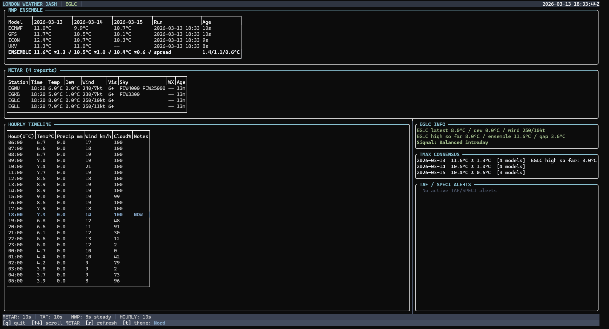

# London Weather Dashboard

This project is a TUI built for identifying relevant weather information that is vital for making informed prediction market trades on the "Highest temperature in London" markets.

A brief list of displayed data:
- live METAR observations from the following four stations; EGLC, EGLL, EGKB and EGWU (obtained via  aviationweather.gov)
- TAF and SPECI alerts for EGLC (obtained via aviationweather.gov)
- 24 hour forecast (obtained via open-meteo)
- NWP model forecasts & ensemble forecast from the following four models; GFS, ECMWF, ICON and UKV (obtained via open-meteo)
- EGLC specific data table displaying latest report, observed high so far and a "signal" signifying current relation to our forecasted high (e.g neutral bias, upside bias or if we have already exceeded our forecasted ensemble high)

